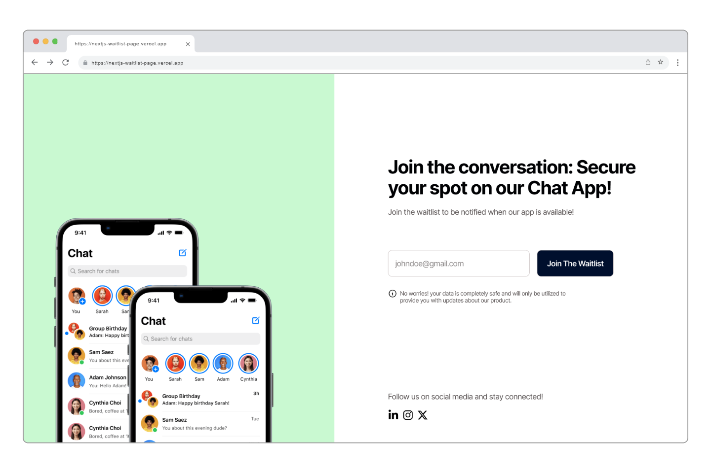

# Next.js + EmailOctopus wait list page



## Description:

A ready-to-use Next.js wait list page that helps you capturing potential customer emails using EmailOctopus service.

- Designed using Figma
- Built using powerful technologies: Next.js, Typescript and Tailwind CSS.
- Mobile responsive

## Getting Started

- Clone this repository

  ```bash
  git clone git@github.com:soufianeelc/nextjs-waitlist-page.git
  ```

- Install dependencies
  ```bash
  pnpm install
  ```


## Deployment

Once you have successfully deployed the project, ensure to set the environment variables as outlined in the `.env.example` file on your hosting platform.

If you encounter any issues during this process, please don't hesitate to contact me at: soufiane-elc@outlook.com.

## Support

If you appreciate my work, you can show your support by [buying me a coffee](https://www.buymeacoffee.com/soufianeelc). Your contribution helps keep the momentum going and fuels the creation of more content.

Thank you for your generosity! ☕
